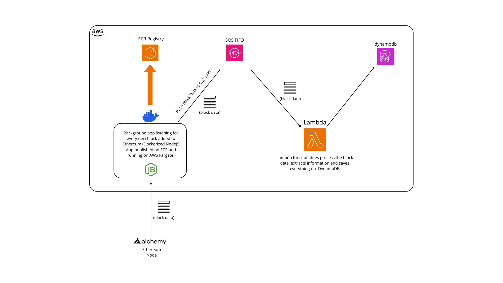

# Intro

This is the backend for my [Etherscan](https://etherscan.io/) clone. It is a simple blockchain explorer that allows you to search for blocks, transactions, and addresses.

You can find the frontend at: [https://github.com/lucadidomenico/blockchain_explorer_frontend](https://github.com/lucadidomenico/blockchain_explorer_frontend)

## YouTube Playlist (ITA)

👉🏻 [https://www.youtube.com/playlist?list=PLpwebJpi_tu3rYba_zooIZSpv1410rQiV](https://www.youtube.com/playlist?list=PLpwebJpi_tu3rYba_zooIZSpv1410rQiV)

## Getting Started

### Install the project

Run the following commands to install the project:

```bash
git clone https://github.com/lucadidomenico/blockchain_explorer_backend
cd ./blockchain_explorer_backend
npm install
```

Run the following commands to deploy on AWS (You will need an AWS account with free tier and your access key and secret keys):

```bash
aws configure
# insert your access key, secret key and region when prompted
npm run build
cdk synth
```

If the latest command returns without any error, deploy the project on AWS with:

```bash
cdk deploy
```

### CDK Architecture



### READ API

- balance in ETH of a specific address (api gateway)
- retrieve the current price in USD of ETH
- list of transactions made or received by a specific address ordered by execution date (db)
- details of a single transaction by hash (db)

## Requirements (all free)

- Alchemy API Key (to connect to Ethereum): [https://www.alchemy.com/](https://www.alchemy.com/)
  - Tutorial (only part 1 to get the API Key): [https://docs.alchemy.com/docs/alchemy-quickstart-guide#1key-create-an-alchemy-key](https://docs.alchemy.com/docs/alchemy-quickstart-guide#1key-create-an-alchemy-key)
- AWS Account (Free Tier): [https://aws.amazon.com/free/](https://aws.amazon.com/free/)
- AWS CDK: [https://aws.amazon.com/getting-started/guides/setup-cdk/module-two/](https://aws.amazon.com/getting-started/guides/setup-cdk/module-two/)
- AWS Console: [https://docs.aws.amazon.com/cli/latest/userguide/getting-started-install.html](https://docs.aws.amazon.com/cli/latest/userguide/getting-started-install.html)
